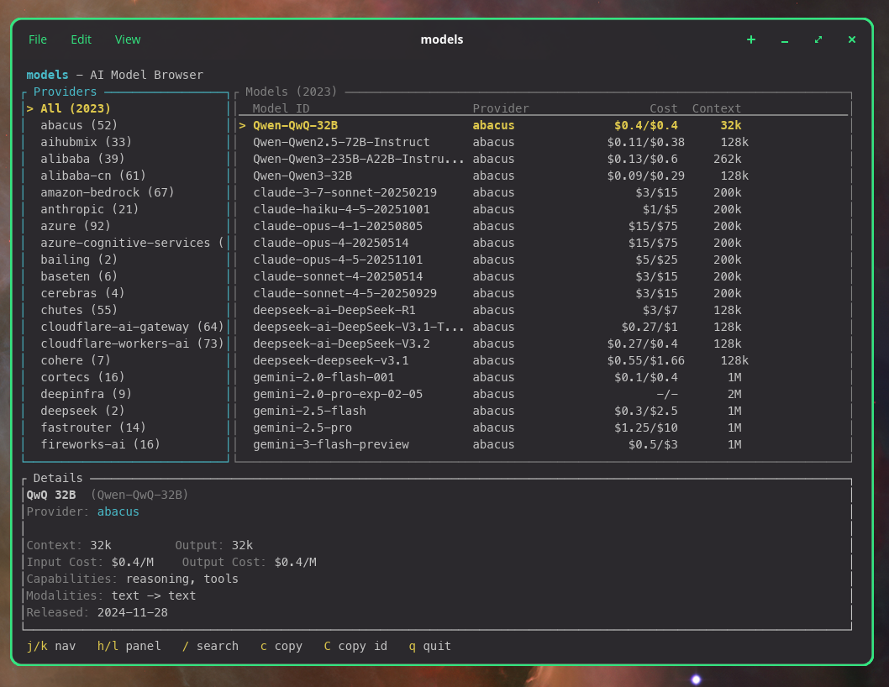
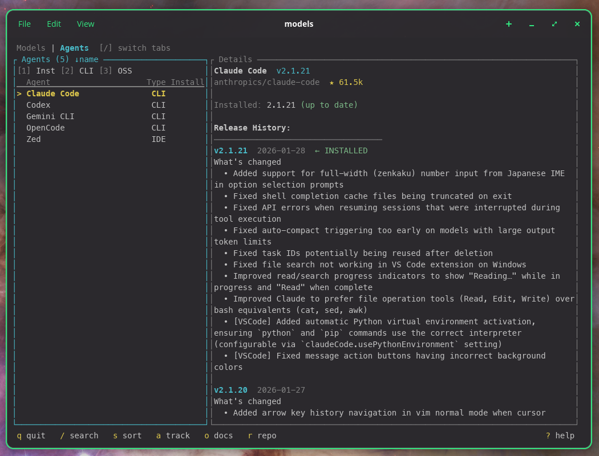

# models

<p align="center">
  <a href="https://crates.io/crates/modelsdev"></a>
  <a href="https://github.com/arimxyer/models/actions/workflows/ci.yml"></a>
  <a href="https://opensource.org/licenses/MIT"></a>
</p>

A fast CLI and TUI for browsing AI models and coding agents.

- **Models Tab**: Browse 2000+ models across 85+ providers from [models.dev](https://models.dev), categorized by type (Origin, Cloud, Inference, Gateway, Dev Tool)
- **Agents Tab**: Track AI coding assistants (Claude Code, Aider, Cursor, etc.) with version detection and GitHub integration

<video src="https://github.com/user-attachments/assets/f4c33f15-8ae7-4997-bb9f-240b79b0b562" controls width="100%"></video>

## Features

### Models Tab
- **CLI commands** for scripting and quick lookups
- **Interactive TUI** for browsing and comparing models
- **Provider categories** — filter and group providers by type (Origin, Cloud, Inference, Gateway, Dev Tool)
- **Cross-provider search** to compare the same model across different providers
- **Copy to clipboard** with a single keypress
- **JSON output** for scripting and automation

### Agents Tab
- **Curated catalog** of 12+ AI coding assistants
- **Version detection** — automatically detects installed agents
- **GitHub integration** — stars, releases, changelogs, update availability
- **Persistent cache** — instant startup with ETag-based conditional fetching
- **Customizable tracking** — choose which agents to monitor

## Installation

### Cargo (from crates.io)

```bash
cargo install modelsdev
```

### Homebrew (macOS/Linux)

```bash
brew install arimxyer/tap/models
```

### Scoop (Windows)

```powershell
scoop bucket add arimxyer https://github.com/arimxyer/scoop-bucket
scoop install models
```

### Pre-built binaries

Download the latest release for your platform from [GitHub Releases](https://github.com/arimxyer/models/releases).

### Build from source

```bash
git clone https://github.com/arimxyer/models
cd models
cargo build --release
./target/release/models
```

## Usage

### TUI (Interactive Browser)

Just run `models` with no arguments to launch the interactive browser:

```bash
models
```



### TUI Keybindings

**Global**
| Key | Action |
|-----|--------|
| `]` / `[` | Switch tabs (Models / Agents) |
| `?` | Show context-aware help |
| `q` | Quit |

**Navigation**
| Key | Action |
|-----|--------|
| `j` / `↓` | Move down |
| `k` / `↑` | Move up |
| `g` | Jump to first item |
| `G` | Jump to last item |
| `Ctrl+d` / `PageDown` | Page down |
| `Ctrl+u` / `PageUp` | Page up |
| `Tab` / `Shift+Tab` | Switch panels |
| `←` / `→` | Switch panels |

**Search**
| Key | Action |
|-----|--------|
| `/` | Enter search mode |
| `Enter` / `Esc` | Exit search mode |
| `Esc` | Clear search (in normal mode) |

### Models Tab

**Filters & Sort**
| Key | Action |
|-----|--------|
| `s` | Cycle sort (name → date → cost → context) |
| `1` | Toggle reasoning filter |
| `2` | Toggle tools filter |
| `3` | Toggle open weights filter |
| `4` | Cycle provider category filter (All → Origin → Cloud → Inference → Gateway → Tool) |
| `5` | Toggle category grouping |

**Copy & Open**
| Key | Action |
|-----|--------|
| `c` | Copy `provider/model-id` |
| `C` | Copy `model-id` only |
| `o` | Open provider docs in browser |
| `D` | Copy provider docs URL |
| `A` | Copy provider API URL |

### Agents Tab



**Filters & Sort**
| Key | Action |
|-----|--------|
| `s` | Cycle sort (name → updated → stars → status) |
| `1` | Toggle installed filter |
| `2` | Toggle CLI tools filter |
| `3` | Toggle open source filter |

**Actions**
| Key | Action |
|-----|--------|
| `a` | Open tracked agents picker |
| `o` | Open docs in browser |
| `r` | Open GitHub repo |
| `c` | Copy agent name |

### Customizing Tracked Agents

By default, models tracks 4 popular agents: Claude Code, Codex, Gemini CLI, and OpenCode.

Press `a` in the Agents tab to open the picker and customize which agents you track. Your preferences are saved to `~/.config/models/config.toml`.

You can also add custom agents not in the catalog:

```toml
# ~/.config/models/config.toml
[[agents.custom]]
name = "My Agent"
repo = "owner/repo"
binary = "my-agent"
version_command = ["--version"]
```

### CLI Commands

#### List providers

```bash
models list providers
```

#### List models

```bash
# All models
models list models

# Models from a specific provider
models list models anthropic
```

#### Show model details

```bash
models show claude-opus-4-5-20251101
```

```
Claude Opus 4.5
===============

ID:          claude-opus-4-5-20251101
Provider:    Anthropic (anthropic)
Family:      claude-opus

Limits
------
Context:     200k tokens
Max Output:  64k tokens

Pricing (per million tokens)
----------------------------
Input:       $5.00
Output:      $25.00
Cache Read:  $0.50
Cache Write: $6.25

Capabilities
------------
Reasoning:   Yes
Tool Use:    Yes
Attachments: Yes
Modalities:  text, image, pdf -> text

Metadata
--------
Released:    2025-11-01
Updated:     2025-11-01
Knowledge:   2025-03-31
Open Weights: No
```

#### Search models

```bash
models search "gpt-4"
models search "claude opus"
```

#### JSON output

All commands support `--json` for scripting:

```bash
models list providers --json
models show claude-opus-4-5 --json
models search "llama" --json
```

## Data Sources

- **Model data**: Fetched from [models.dev](https://models.dev), an open-source database of AI models maintained by [SST](https://github.com/sst/models.dev)
- **Agent data**: Curated catalog in [`data/agents.json`](data/agents.json) — contributions welcome!
- **GitHub data**: Fetched from GitHub API (stars, releases, changelogs)

## License

MIT
