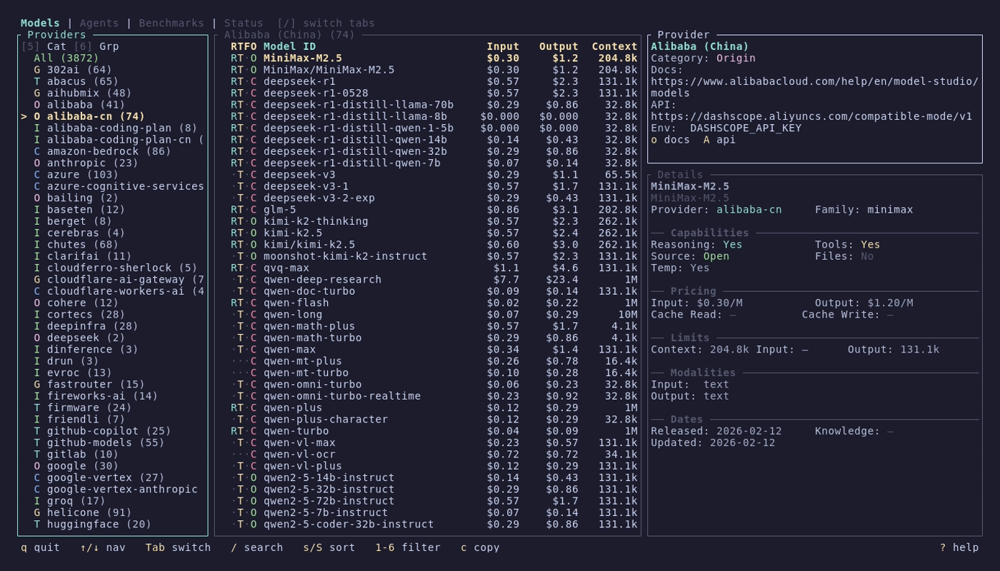
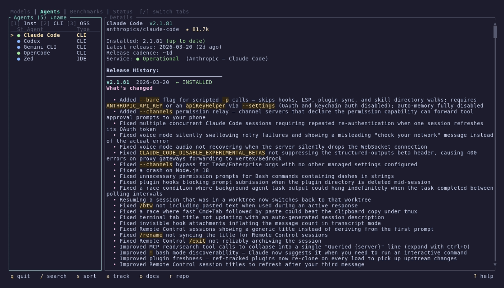
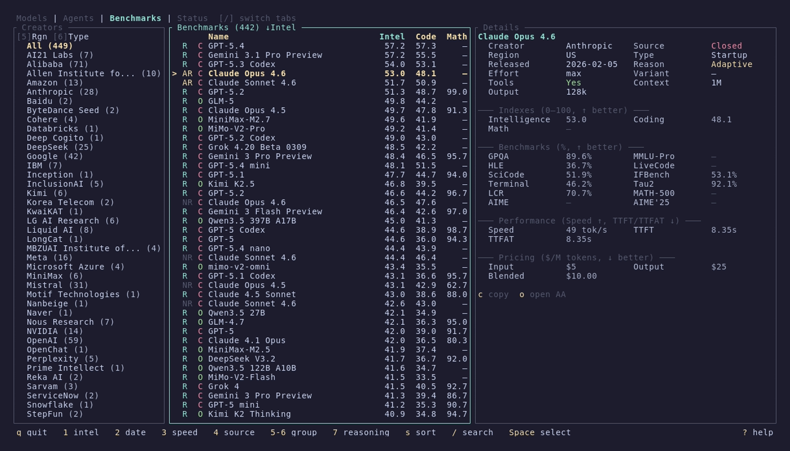
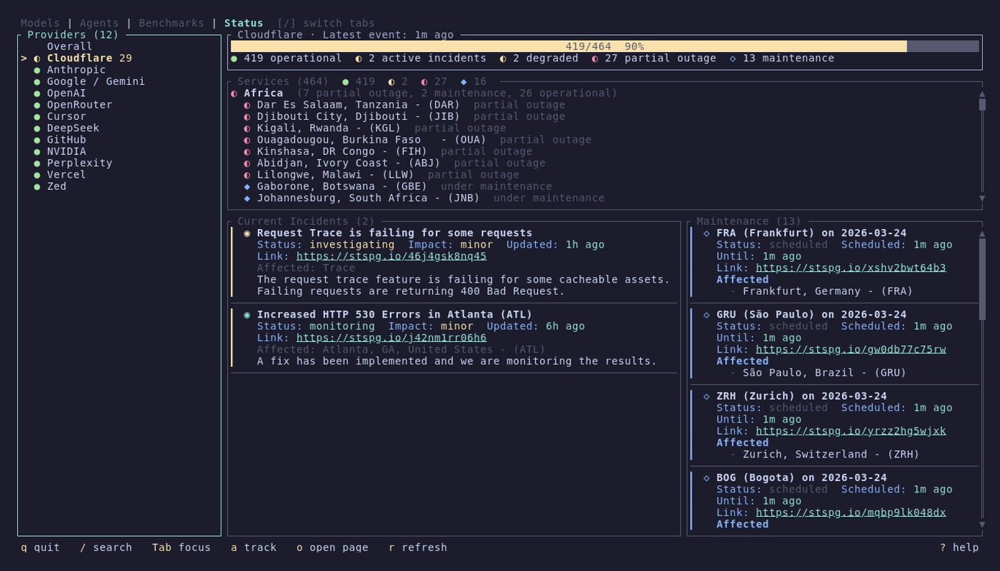

# models

<p align="center">
  <a href="https://crates.io/crates/modelsdev"></a>
  <a href="https://github.com/arimxyer/models/actions/workflows/update-benchmarks.yml"></a>
  <a href="https://opensource.org/licenses/MIT"></a>
</p>

TUI and CLI for browsing AI models, benchmarks, coding agents, and statuses for AI providers. 

- **Models Tab**: Browse 3,000+ models across 85+ providers from [models.dev](https://models.dev) with capability indicators, adaptive layouts, and provider categorization
- **Agents Tab**: Track AI coding assistants (Claude Code, Aider, Cursor, etc.) with version detection, changelogs, and GitHub integration
- **Benchmarks Tab**: Compare model performance across 15+ benchmarks from [Artificial Analysis](https://artificialanalysis.ai), with head-to-head tables, scatter plots, radar charts, and creator filtering
- **Status Tab**: Monitor provider health with live incident tracking and scheduled maintenance across 21+ providers

<video src="https://github.com/user-attachments/assets/07c750f4-ca47-4f89-8a32-99e0be5004d8" controls width="100%"></video>
> **Video (and screenshots below) are out-of-sync with the current state of the app, I've been moving fast on making changes and so I'll have to record a new one!**

## What's New

- **Status tab** — live provider health monitoring with incidents, maintenance, and customizable provider tracking
- **Agent service health** — live operational status from provider status pages in the agents detail panel and CLI
- **Scrollable detail panels** — Models and Benchmarks detail panels are now navigable and scrollable
- **CLI revamp** — all three inline pickers (models, benchmarks, agents) redesigned with side-by-side layouts and rich previews
- **Benchmarks CLI** — query benchmark data directly from the terminal with interactive picker and JSON output

## Features

### Models Tab
- **Capability indicators** — see Reasoning, Tools, Files, and Open/Closed status at a glance in the model list
- **Provider categories** — filter and group providers by type (Origin, Cloud, Inference, Gateway, Dev Tool)
- **Detail panel** — capabilities, pricing, modalities, and metadata for the selected model
- **Cross-provider search** to compare the same model across different providers
- **Copy to clipboard** with a single keypress
- **CLI commands** and **JSON output** for scripting and automation

### Agents Tab
- **Curated catalog** of 12+ AI coding assistants
- **Version detection** — automatically detects installed agents
- **GitHub integration** — stars, releases, changelogs, update availability
- **Service health** — live operational status from provider status pages for mapped agents
- **Styled changelogs** — markdown rendering with syntax highlighting in the detail pane
- **Changelog search** — search across changelogs with highlighted matches and `n`/`N` jump-to-match
- **Scrollable detail panel** — navigate and scroll release metadata, service health, and changelogs
- **Persistent cache** — instant startup with ETag-based conditional fetching
- **Customizable tracking** — choose which agents to monitor

### Benchmarks Tab
- **~400 benchmark entries** from Artificial Analysis with quality, speed, and pricing scores
- **Compare mode** — select models for head-to-head tables, scatter plots, and radar charts
- **Auto-updating** — benchmark data refreshed automatically every 30 minutes
- **Creator sidebar** with 40+ creators — filter by region, type, or open/closed source
- **Sort & filter** — sort by any metric, filter by reasoning capability, source type, and more
- **Detail panel** — full benchmark breakdown with indexes, scores, performance, and pricing

### Status Tab
- **Live provider health** — monitor 21+ AI providers across 7 status page platforms
- **Health indicators** — operational (●), degraded (◐), outage (✗), maintenance (◆)
- **Overall dashboard** — health gauge, incident and maintenance cards at a glance
- **Provider detail** — grouped services, incidents, and scheduled maintenance
- **Multi-source** — unified status from Statuspage, BetterStack, Instatus, incident.io, and more
- **Customizable tracking** — choose which providers to monitor (press `a` to open the tracking picker)

### Agents CLI
- **Status table** — see installed vs latest version, 24h release indicator, release frequency, and live service health icons at a glance, sorted by most recently updated
- **Inline release browser** — `agents <tool>` opens an interactive version browser with changelog preview
- **Changelogs** — view release notes for any agent by name, latest version, or explicit version
- **Tracked-agent manager** — `agents list-sources` can now manage which curated agents are tracked from the CLI
- **Dual entry point** — use as `models agents` or create an `agents` symlink for standalone usage
- **Fast** — concurrent GitHub fetching and version detection

### Benchmarks CLI
- **Live benchmark queries** — fetch the current benchmark dataset without launching the TUI
- **Interactive list picker** — use `models benchmarks list` to open a filtered benchmark selector, then inspect the selected model immediately
- **Detail views** — use `models benchmarks show` for a direct model breakdown, with interactive disambiguation when a query matches multiple variants
- **Filtering** — narrow by search text, creator, open/closed source, and reasoning status
- **Sorting** — sort by any supported metric, including intelligence, coding, math, GPQA, speed, pricing, and release date
- **JSON output** — pipe structured benchmark data into shell scripts and other tools

## Installation

### Cargo (from crates.io)

```bash
cargo install modelsdev
```

### Homebrew (macOS/Linux)

```bash
brew install models
```

> **Migrating from the tap?** Run `brew untap arimxyer/tap` — updates now land through `homebrew-core` bump PRs and may take a bit to merge.

### Scoop (Windows)

```powershell
scoop install extras/models
```

> **Migrating from the custom bucket?** Run `scoop bucket rm arimxyer` — Scoop Extras handles updates automatically.

### Arch Linux (AUR)

```bash
paru -S models-bin   # or: yay -S models-bin
```

> Maintained by [@Dominiquini](https://aur.archlinux.org/packages/models-bin)

### Debian / Ubuntu

Download the `.deb` from [GitHub Releases](https://github.com/arimxyer/models/releases) and install:

```bash
# Download the latest .deb for your architecture (amd64 or arm64)
sudo dpkg -i modelsdev_*_amd64.deb
```

### Fedora / RHEL

Download the `.rpm` from [GitHub Releases](https://github.com/arimxyer/models/releases) and install:

```bash
# Download the latest .rpm for your architecture (x86_64 or aarch64)
sudo rpm -i modelsdev-*.x86_64.rpm
```

> **Verifying downloads**: Each GitHub Release includes a `SHA256SUMS` file. After downloading, verify with: `sha256sum -c SHA256SUMS --ignore-missing`

### Pre-built binaries

Download the latest release for your platform from [GitHub Releases](https://github.com/arimxyer/models/releases).

### Build from source

```bash
git clone https://github.com/arimxyer/models
cd models
cargo build --release
./target/release/models
```

## TUI Usage

### Interactive Browser

Run `models` with no arguments to launch the interactive TUI:

```bash
models
```



### Keybindings

**Global**
| Key | Action |
|-----|--------|
| `]` / `[` | Switch tabs (Models / Agents / Benchmarks / Status) |
| `?` | Show context-aware help |
| `q` | Quit |

**Navigation**
| Key | Action |
|-----|--------|
| `j` / `↓` | Move down |
| `k` / `↑` | Move up |
| `g` | Jump to first item |
| `G` | Jump to last item |
| `Ctrl+d` / `PageDown` | Page down |
| `Ctrl+u` / `PageUp` | Page up |
| `Tab` / `Shift+Tab` | Switch panels |
| `←` / `→` | Switch panels |

**Search**
| Key | Action |
|-----|--------|
| `/` | Enter search mode |
| `Enter` / `Esc` | Exit search mode |
| `Esc` | Clear search (in normal mode) |

### Models Tab

**Filters & Sort**
| Key | Action |
|-----|--------|
| `s` | Cycle sort (name → date → cost → context) |
| `S` | Toggle sort direction (asc/desc) |
| `1` | Toggle reasoning filter |
| `2` | Toggle tools filter |
| `3` | Toggle open weights filter |
| `4` | Toggle free models filter |
| `5` | Cycle provider category filter (All → Origin → Cloud → Inference → Gateway → Tool) |
| `6` | Toggle category grouping |

**Copy & Open**
| Key | Action |
|-----|--------|
| `c` | Copy `provider/model-id` |
| `C` | Copy `model-id` only |
| `o` | Open provider docs in browser |
| `D` | Copy provider docs URL |
| `A` | Copy provider API URL |

### Agents Tab



**Filters & Sort**
| Key | Action |
|-----|--------|
| `s` | Cycle sort (name → updated → stars → status) |
| `1` | Toggle installed filter |
| `2` | Toggle CLI tools filter |
| `3` | Toggle open source filter |

**Search**
| Key | Action |
|-----|--------|
| `/` | Search agents and changelogs |
| `n` | Jump to next match |
| `N` | Jump to previous match |

**Actions**
| Key | Action |
|-----|--------|
| `a` | Open tracked agents picker |
| `o` | Open docs in browser |
| `r` | Open GitHub repo |
| `c` | Copy agent name |

### Customizing Tracked Agents

By default, models tracks 4 popular agents: Claude Code, Codex, Gemini CLI, and OpenCode.

Press `a` in the Agents tab to open the picker and customize which agents you track. Your preferences are saved to `~/.config/models/config.toml`.

You can also add custom agents not in the catalog:

```toml
# ~/.config/models/config.toml
[[agents.custom]]
name = "My Agent"
repo = "owner/repo"
binary = "my-agent"
version_command = ["--version"]
```

See [Custom Agents](docs/custom-agents.md) for the full reference.

### Benchmarks Tab



**Quick Sort** (press again to toggle direction)
| Key | Action |
|-----|--------|
| `1` | Sort by Intelligence index |
| `2` | Sort by Release date |
| `3` | Sort by Speed (tok/s) |

**Filters**
| Key | Action |
|-----|--------|
| `4` | Cycle source filter (All / Open / Closed) |
| `5` | Cycle region filter (US / China / Europe / ...) |
| `6` | Cycle type filter (Startup / Big Tech / Research) |
| `7` | Cycle reasoning filter (All / Reasoning / Non-reasoning) |

**Sort**
| Key | Action |
|-----|--------|
| `s` | Open sort picker popup |
| `S` | Toggle sort direction (asc/desc) |

**Compare Mode**
| Key | Action |
|-----|--------|
| `Space` | Toggle model selection (max 8) |
| `v` | Cycle view (H2H table → Scatter → Radar) |
| `t` | Toggle left panel (Models / Creators) |
| `d` | Show detail overlay (H2H view) |
| `c` | Clear all selections |
| `h` / `l` | Switch focus (List / Compare) |
| `j` / `k` | Scroll H2H table (when Compare focused) |
| `x` / `y` | Cycle scatter plot axes |
| `a` | Cycle radar chart preset |

**Actions**
| Key | Action |
|-----|--------|
| `o` | Open Artificial Analysis page |

### Status Tab



- **22 AI providers tracked** across 7 status page platforms (Statuspage, BetterStack, Instatus, incident.io, and more)
- **Overall dashboard** — health gauge, incident count, and maintenance cards at a glance
- **Provider detail** — grouped services, active incidents, and scheduled maintenance windows
- **Health indicators** — operational (●), degraded (◐), outage (✗), maintenance (◆)
- **Customizable tracking** — press `a` to choose which providers to monitor; preferences saved to `~/.config/models/config.toml`

**Navigation**
| Key | Action |
|-----|--------|
| `Tab` / `h` / `l` | Switch focus (List ↔ Detail) |
| `h` / `l` | Cycle detail sub-panels (Services / Incidents / Maintenance) |
| `/` | Search providers |

**Actions**
| Key | Action |
|-----|--------|
| `o` | Open provider status page in browser |
| `r` | Refresh provider status |
| `a` | Add/remove tracked providers |

---

## CLI Usage

### Benchmarks CLI

Query benchmark data from the command line using the same live benchmark feed as the Benchmarks tab.

#### Interactive benchmark picker

```bash
models benchmarks list
models benchmarks list --sort speed --limit 10
models benchmarks list --creator openai --reasoning
models benchmarks list --open --sort price-input --asc
```

`models benchmarks list` opens the inline picker in an interactive terminal and uses the same filters/sorting to narrow the candidate set before you pick a model.

Once the picker is open:
- `/` starts a live text filter over name, slug, and creator
- `s` cycles sort metrics
- `S` reverses the current sort
- `Enter` prints the selected model's normal `show` output

#### Show benchmark details

```bash
models benchmarks show gpt-4o
models benchmarks show "Claude Sonnet 4"
```

If `show` matches multiple benchmark variants in an interactive terminal, the CLI reopens the picker with just the matching candidates so you can choose the exact row you want.

#### JSON output

```bash
models benchmarks list --creator anthropic --json
models benchmarks show gpt-4o --json
```

### Standalone `benchmarks` command

Like the agents CLI, you can create a symlink for standalone usage:

```bash
ln -s $(which models) ~/.local/bin/benchmarks
benchmarks list
benchmarks show gpt-4o
```

> **Note:** Make sure `~/.local/bin` is in your `PATH`. See the agents setup note below for shell-specific instructions.

### Agents CLI

Track AI coding agent releases from the command line. Install the `agents` alias during setup, or use `models agents` as a fallback. The `benchmarks` command supports the same dual entry point pattern.

```bash
# Create the agents alias (one-time setup)
mkdir -p ~/.local/bin
ln -s $(which models) ~/.local/bin/agents
```

> **Note:** Make sure `~/.local/bin` is in your `PATH`. For example, in **bash/zsh** add `export PATH="$HOME/.local/bin:$PATH"` to your shell config, or in **fish** run `fish_add_path ~/.local/bin`.

#### Status table

```bash
agents status
```

```
┌──────────────┬─────┬───────────┬──────────┬─────────┬───────────────┐
│ Tool         │ 24h │ Installed │ Latest   │ Updated │ Freq.         │
├──────────────┼─────┼───────────┼──────────┼─────────┼───────────────┤
│ Claude Code  │ ✓   │ 2.1.42    │ 2.1.42   │ 1d ago  │ ~1d           │
│ OpenAI Codex │ ✓   │ 0.92.0    │ 0.92.0   │ 6h ago  │ ~3h           │
│ Goose        │     │ —         │ 1.0.20   │ 3d ago  │ ~2d           │
└──────────────┴─────┴───────────┴──────────┴─────────┴───────────────┘
```

#### View changelogs

```bash
agents claude              # Interactive release browser (by CLI binary name)
agents claude-code         # By agent ID
agents claude --latest     # Latest release directly
agents claude --version 1.0.170  # Specific version
```

#### Browse versions

```bash
agents claude --list       # List all versions
agents claude --pick       # Alias for the interactive release browser
```

In the release browser:
- `↑`/`↓` or `j`/`k` moves between releases
- the lower pane previews the selected release notes
- `Enter` prints the full changelog for the selected release

#### Other commands

```bash
agents latest              # Interactive picker for releases from the last 24 hours
agents list-sources        # Interactive tracked-agent manager
agents claude --web        # Open GitHub releases in browser
```

### Models CLI

#### Interactive model picker

```bash
models list
models list anthropic
```

`models list` opens the inline picker in an interactive terminal. Use a provider argument to prefilter the picker before it opens.

Once the picker is open:
- `/` starts a live filter over model id, name, and provider
- `s` cycles sort modes
- `S` reverses the current sort
- `Enter` prints the selected model's normal `show` output

#### Providers

```bash
models providers
models providers --json
```

#### Show model details

```bash
models show claude-opus-4-5-20251101
```

```
Claude Opus 4.5
===============

ID:          claude-opus-4-5-20251101
Provider:    Anthropic (anthropic)
Family:      claude-opus

Limits
------
Context:     200k tokens
Max Output:  64k tokens

Pricing (per million tokens)
----------------------------
Input:       $5.00
Output:      $25.00
Cache Read:  $0.50
Cache Write: $6.25

Capabilities
------------
Reasoning:   Yes
Tool Use:    Yes
Attachments: Yes
Modalities:  text, image, pdf -> text

Metadata
--------
Released:    2025-11-01
Updated:     2025-11-01
Knowledge:   2025-03-31
Open Weights: No
```

If `show` matches multiple providers or model variants in an interactive terminal, the CLI reopens the picker with the matching candidates so you can choose the exact row.

#### Search models

```bash
models search "gpt-4"
models search "claude opus"
```

`models search` currently reuses the same matcher and interactive picker flow as `models list`, so it remains available as a compatibility command.

#### JSON output

All models and benchmarks commands support `--json` for scripting:

```bash
models benchmarks list --json
models benchmarks show gpt-4o --json
models list --json
models providers --json
models show claude-opus-4-5 --json
models search "llama" --json
```

## Data Sources

Lots of gratitude to the companies who do all the hard work! Shout out to the sources:
- **Model data**: Fetched from [models.dev](https://models.dev), an open-source database of AI models maintained by [SST](https://github.com/sst/models.dev)
- **Benchmark data**: Fetched from [Artificial Analysis](https://artificialanalysis.ai) — quality indexes, benchmark scores, speed, and pricing for ~400 model entries
- **Agent data**: Curated catalog in [`data/agents.json`](data/agents.json) — contributions welcome!
- **GitHub data**: Fetched from GitHub API (stars, releases, changelogs)
- **Status data**: Fetched from each provider's official status page — [Statuspage](https://www.atlassian.com/software/statuspage), [BetterStack](https://betterstack.com), [Instatus](https://instatus.com), [incident.io](https://incident.io), and others — with [apistatuscheck.com](https://apistatuscheck.com) as fallback

## Roadmap

- **Nix flake** — Nix packaging with a proper `flake.lock` for reproducible builds (PRs welcome!)

## Contributing

Contributions are welcome! Please read the [Contributing Guide](CONTRIBUTING.md) before submitting a PR.

This project follows the [Contributor Covenant Code of Conduct](CODE_OF_CONDUCT.md).

## License

MIT
